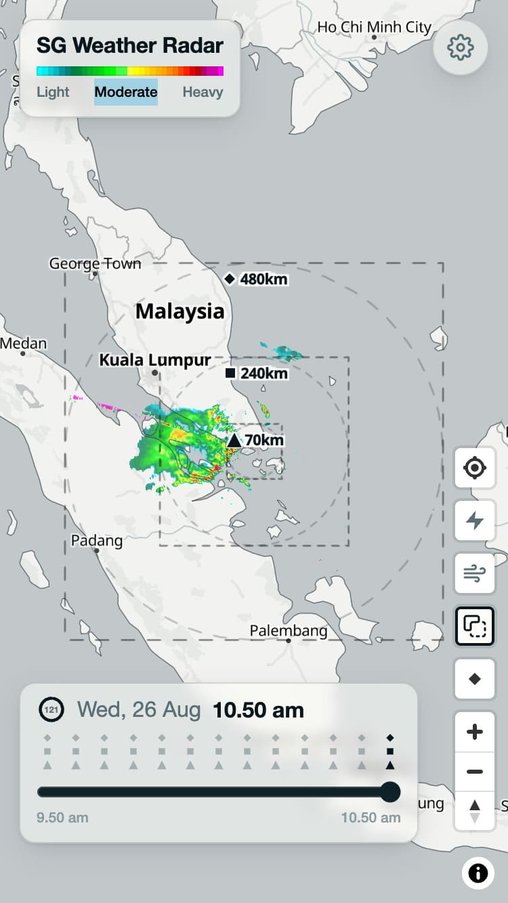
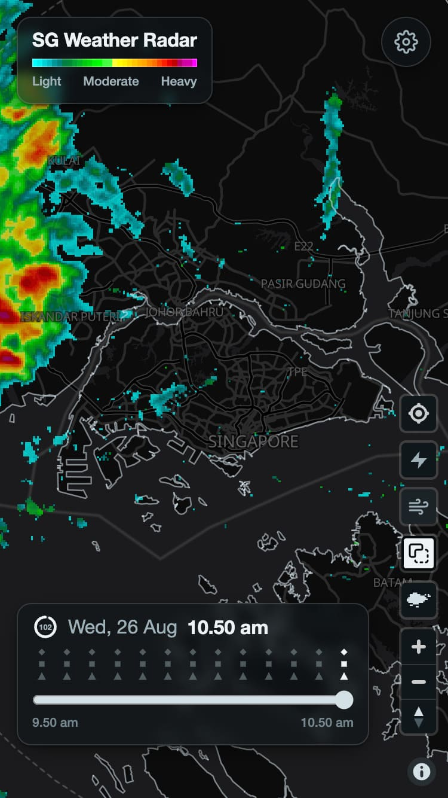

# SG Weather Radar

Real-time Singapore rainfall radar on a MapLibre GL map, powered by [NEA data via data.gov.sg](https://data.gov.sg).

**Live site:** <https://sg-weather-radar.cheeaun.workers.dev>

Runs as a single Cloudflare Worker: the site is served as static assets and `/api/*` requests are proxied server-side so the data.gov.sg API key is never exposed to the browser. Built with the [Cloudflare Vite plugin](https://developers.cloudflare.com/workers/vite-plugin/).

 

## Features

- Radar imagery composited from three ranges (70 km, 240 km, 480 km) centered on Singapore
- One-line rain summary (e.g. “Heavy rain in the west”) computed from the 70 km frame, scoped to the Singapore landmass so rain across the causeway in Johor isn’t counted
- Time scrubber over the past hour of radar frames
- Auto-refresh aligned to 5-minute feed slots: polls every 30s until a slot's data is complete, then idles until the next slot (pausing when hidden)
- MRT/LRT lines and stations overlay
- Optional cloud-to-ground lightning overlay
- Optional PUB flood-alert overlay (broadcast-radius circles + icons)
- Optional (off by default) wind particle animation driven by station wind readings
- Optional (off by default) 15-minute rain nowcast: adds +5/+10/+15 min forecast slots to the timeline, computed client-side from the latest radar frames and station winds — rain approaching from outside Singapore (up to the 70 km radar edge) is included; implementation notes in [NOWCAST.md](NOWCAST.md)
- Optional (off by default) temperature chips: air temp + feels-like delta (damped heat index / apparent temperature with wind, floored by NEA WBGT) at NEA stations, plus one-line WBGT chips where they fill gaps; white type with a thermal OKLCH outline (muted teal ≤25° → vivid red ≥32°; chroma tracks heat)
- Optional (off by default) AQI station chips from [WAQI / aqicn.org](https://waqi.info) inside the 480 km radar square (number on a rounded rect in the US EPA palette; relative reading age on hover or when zoomed in)
- System / light / dark themes with matching map styles
- Adjustable radar opacity and boundary clipping
- Geolocate and navigation controls
- Responsive layout with a mobile settings sheet

## Data Sources

- Radar images: [NEA Weather Radar Images API](https://data.gov.sg/datasets/d_418e9ac3414fd927b7405631e0a7bc82/view) via `api-open.data.gov.sg` (proxied through the Worker)
- Lightning: [NEA Lightning API](https://data.gov.sg/datasets/d_08238953fe0f6dd13f10714ebfbcb9f9/view) via `api-open.data.gov.sg` (proxied through the Worker)
- Wind speed & direction: [NEA Wind Speed API](https://data.gov.sg/datasets/d_7677738484067741bf3b56ab5d69c7e9/view) / [NEA Wind Direction API](https://data.gov.sg/datasets/d_534cf203023b51f51f879145ccc56ff9/view) via `api-open.data.gov.sg` (proxied through the Worker)
- Air temperature & relative humidity: NEA real-time `/air-temperature` and `/relative-humidity` via `api-open.data.gov.sg` (proxied through the Worker)
- Wet Bulb Globe Temperature: [NEA WBGT Observations API](https://data.gov.sg/datasets/d_87884af1f85d702d4f74c6af13b4853d/view) (`/weather?api=wbgt`) via `api-open.data.gov.sg` (proxied through the Worker) — heat-stress floor for feels-like
- Rail lines & stations: [cheeaun/sgraildata](https://github.com/cheeaun/sgraildata), compiled to `rail.json` by `scripts/build-rail-data.mjs` and bundled with the app
- AQI stations: [WAQI map-bounds API](https://aqicn.org/api/) (aqicn.org) via `api.waqi.info` (proxied through the Worker with `WAQI_TOKEN`) — see [AQI data](#aqi-data)
- Singapore landmass boundary (for the rain summary): [URA Master Plan 2025 Planning Area Boundary (No Sea)](https://data.gov.sg/datasets/d_2cc750190544007400b2cfd5d7f53209/view), compiled into the bundled rain-pixel index by `scripts/build-rain-data.mjs`
- Map tiles: [OpenFreeMap](https://openfreemap.org)

Data from data.gov.sg is covered by the [Singapore Open Data Licence](https://data.gov.sg/open-data-licence).

## Setup

1. Install dependencies:
   ```sh
   npm install
   ```
2. Copy `.dev.vars.example` to `.dev.vars` (gitignored) and fill in your data.gov.sg API key (create a free data.gov.sg account, then generate a key from the API tab of any dataset page):
   ```sh
   cp .dev.vars.example .dev.vars
   ```
3. Start the dev server:
   ```sh
   npm run dev
   ```
   The app runs at http://localhost:5151. The site and the `/api/*` proxy both run locally via the Cloudflare Vite plugin (the Worker code executes in workerd).

## Deploy to production

The Worker (`wrangler.jsonc`: `sg-weather-radar`) is connected to this repo via Cloudflare dashboard Git integration (Workers Builds). Pushing to `main` runs `npm run build` then `npx wrangler deploy`. The site and the API proxy ship together; the app calls same-origin `/api/*` paths (`worker/index.js` allowlists the routes and injects the data.gov.sg key via the `x-api-key` header).

### Secrets and build variables

Cloudflare separates these — build settings are invisible at runtime and vice versa:

| Where | What | Why |
| --- | --- | --- |
| Settings → Variables & Secrets (runtime) | `DATA_GOV_SG_API_KEY`, `WAQI_TOKEN` | Worker `/api/*` proxy |
| Settings → Build → Build variables and secrets | `VITE_AQI_UI=1` (or `WAQI_TOKEN`) | AQI map control is baked at build time; runtime secrets are not visible to `npm run build` |

To change a build-time flag, push a new commit so Workers Builds rebuilds. Manual deploy is still available: `npx wrangler login`, set secrets with `npx wrangler secret put …`, then `npm run build && npx wrangler deploy`.

## Build

```sh
npm run build    # outputs to dist/
npm run preview  # runs the build in the Workers runtime locally
```

## Rail data

The bundled `rail.json` (MRT/LRT lines + stations) is generated from `data/sg-rail.geojson` ([cheeaun/sgraildata](https://github.com/cheeaun/sgraildata)) — coordinates are delta-encoded and simplified to keep the bundle small:

```sh
node scripts/build-rail-data.mjs
```

Only rerun this when updating the underlying rail dataset.

## Rain-summary boundary

The rain summary filters radar pixels to Singapore's planning areas using data from `data/sg-planning-area.geojson` (URA Master Plan 2025 Planning Area Boundary (No Sea) via data.gov.sg). The geometry is Douglas-Peucker simplified in memory; `rain-pixels.json` is a precomputed 70 km radar pixel-to-area lookup:

```sh
node scripts/build-rain-data.mjs
```

This rebuilds `rain-pixels.json` and `areas-idx.json`. Rerun it when updating the underlying planning-area dataset or the fixed radar-grid mapping.

## AQI data

Live station readings from the [World Air Quality Index project](https://waqi.info) ([aqicn.org](https://aqicn.org/api/)), proxied through the Worker with `WAQI_TOKEN`. Free token: [aqicn.org/data-platform/token/](https://aqicn.org/data-platform/token/). The map control is included at build time when `WAQI_TOKEN` is present in `.dev.vars` or the build environment, or when `VITE_AQI_UI=1` is set — see [Deploy to production](#deploy-to-production).

One chip per station (US EPA AQI, WAQI palette) inside the 480 km radar square. Hover a chip, or zoom in, to see how old the reading is. Live only — not scrubbed with the radar timeline.

## Icons

The icon master is `design/icon.svg` (64×64 grid, pixelated radar-echo cells colored with the reflectivity swatch). `public/` icons are derived from it — never edit them directly:

```sh
node scripts/generate-icons.mjs
```

This writes `public/favicon.svg`, `public/apple-touch-icon.svg` (full-bleed, no corner radius), plus rasterized `favicon-64.png` and `apple-touch-icon.png` (requires `rsvg-convert`).

## License

[MIT](LICENSE)
